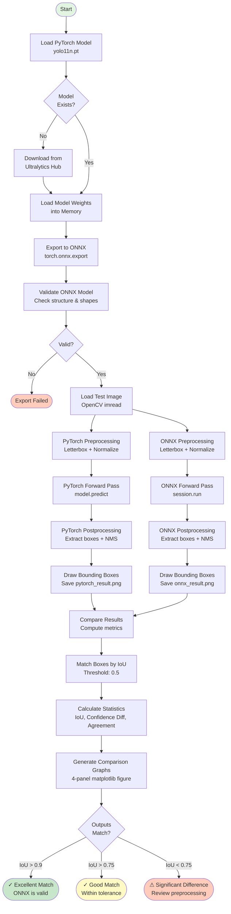

# PyTorch-ONNX Validation Suite

A comprehensive validation framework for verifying YOLO model conversions from PyTorch to ONNX format. This suite provides automated testing, numerical comparison, and visualization tools to ensure model consistency across inference frameworks.

## Project Overview

### Primary Objective

This validation suite addresses a critical challenge in production ML systems: ensuring that deep learning models produce consistent, numerically equivalent outputs after conversion from training frameworks (PyTorch) to optimized inference runtimes (ONNX). Specifically, this tool validates YOLO11 object detection models across both frameworks using rigorous comparison metrics and visual analysis.

### Problem Statement

When deploying neural networks to production, models are often converted from PyTorch (training-optimized) to ONNX (inference-optimized) format. This conversion process involves:

- Graph transformations and optimizations
- Operator mapping between frameworks
- Weight serialization/deserialization
- Runtime environment changes

Each step introduces potential sources of numerical divergence. This suite provides systematic validation to detect and quantify these differences, ensuring that model behavior remains consistent post-conversion.

### Solution Architecture

The validation suite implements a three-stage verification pipeline:

1. **Export Validation**: Converts PyTorch models to ONNX format with structural validation
2. **Inference Comparison**: Executes identical inputs through both frameworks and captures outputs
3. **Numerical Analysis**: Quantifies differences using IoU metrics, confidence score analysis, and statistical comparison

---

## YOLO Inference Pipeline

### What is YOLO?

YOLO (You Only Look Once) is a real-time object detection architecture that frames detection as a regression problem. Unlike two-stage detectors (R-CNN family), YOLO processes the entire image in a single forward pass, making it exceptionally fast for real-time applications.

### YOLO11 Architecture Overview

YOLO11 (YOLOv11) represents the latest evolution in the YOLO family, featuring:

- **Backbone**: CSPDarknet-based feature extractor
- **Neck**: PANet (Path Aggregation Network) for multi-scale feature fusion
- **Head**: Decoupled detection head for classification and localization

### Inference Pipeline Breakdown

#### 1. Preprocessing Stage

```
Input Image (HWC, BGR) → Preprocessing → Model Input Tensor (BCHW, RGB, float32)
```

**Operations:**
- **Letterbox Resize**: Maintains aspect ratio while resizing to 640×640
  - Calculates scaling ratio to fit within target dimensions
  - Adds symmetric padding (letterbox bars) to reach exact size
  - Padding color: (114, 114, 114) - neutral gray
  
- **Color Space Conversion**: BGR → RGB
  - OpenCV loads images in BGR format
  - Neural networks are trained with RGB inputs
  - Mismatched color spaces cause complete detection failure

- **Normalization**: [0, 255] → [0, 1]
  - Scales pixel intensities to floating-point range
  - Stabilizes gradient flow during training
  - Required for numerical stability in inference

- **Tensor Transformation**: HWC → CHW
  - Height, Width, Channels → Channels, Height, Width
  - PyTorch/ONNX convention (channels-first)
  - Enables efficient GPU memory access patterns

- **Batch Dimension**: [C, H, W] → [1, C, H, W]
  - Adds batch dimension for single-image inference
  - Models expect batched inputs even for batch_size=1

#### 2. Forward Pass

```python
Input: [1, 3, 640, 640]  # Batch, Channels, Height, Width
Output: [1, 84, 8400]    # Batch, (4 coords + 80 classes), Anchors
```

The model generates 8,400 anchor predictions across three detection scales:
- **80×80 grid**: Small object detection (6,400 anchors)
- **40×40 grid**: Medium object detection (1,600 anchors)
- **20×20 grid**: Large object detection (400 anchors)

Each prediction contains:
- **Box coordinates (4 values)**: [x_center, y_center, width, height] in model space
- **Class scores (80 values)**: Confidence for each COCO class

#### 3. Postprocessing Stage

**Box Decoding:**
- Convert from xywh (center format) to xyxy (corner format)
- Scale coordinates from model space (640×640) to original image dimensions
- Account for letterbox padding and scaling ratio

**Confidence Filtering:**
```python
confidence = max(class_scores)  # Take highest class score
if confidence >= threshold:     # Default: 0.25 (25%)
    keep_detection()
```

**Non-Maximum Suppression (NMS):**
- Purpose: Remove duplicate detections of the same object
- Algorithm: Greedy selection based on confidence score
- Metric: IoU (Intersection over Union) between boxes
- Threshold: 0.45 (suppress boxes with >45% overlap)

**Class Mapping:**
- Map numeric class IDs to COCO labels
- 80 classes: person, car, dog, bicycle, etc.

#### 4. Output Format

```python
boxes: [[x1, y1, x2, y2], ...]          # Bounding box corners in pixels
class_names: ["person", "car", ...]      # Human-readable labels
confidences: [0.89, 0.76, ...]           # Detection confidence [0, 1]
```

### Critical Implementation Details

**Why Letterbox Matters:**
- Aspect ratio distortion breaks spatial priors learned during training
- Models expect consistent input dimensions
- Padding preserves geometric relationships in scenes

**Why Preprocessing Must Match:**
- Different resize algorithms (bilinear vs nearest) produce different pixel values
- Normalization differences accumulate through 50+ network layers
- Single-pixel errors at input become multi-pixel errors at output

---

## ONNX: Universal Model Format

### What is ONNX?

ONNX (Open Neural Network Exchange) is an open-standard intermediate representation for machine learning models. It provides a portable computation graph format that decouples model training from deployment infrastructure.

### Key Architectural Components

**1. Computation Graph**
- Directed acyclic graph (DAG) of operations
- Nodes represent operations (Conv2d, ReLU, MatMul, etc.)
- Edges represent tensors flowing between operations
- Metadata includes shapes, types, and attributes

**2. Operator Set (Opset)**
- Standardized library of ~150 operations
- Version-controlled for backward compatibility
- Custom operators for framework-specific functionality
- This project uses Opset 12 (stable, widely supported)

**3. Model Serialization**
- Protocol Buffers (protobuf) binary format
- Efficient storage and deserialization
- Includes weights, architecture, and metadata

### Why Use ONNX for Deployment?

#### Performance Advantages

| Metric | PyTorch | ONNX Runtime | Improvement |
|--------|---------|--------------|-------------|
| Inference Speed | Baseline | 1.5-3x faster | Framework overhead eliminated |
| Memory Usage | Baseline | 20-40% reduction | Graph optimizations |
| Model Size | Baseline | Similar | Both store float32 weights |
| Startup Time | ~2-5 seconds | ~50-200ms | No Python interpreter overhead |

#### Technical Benefits

**1. Graph Optimizations**
- Operator fusion (Conv + BatchNorm + ReLU → Single fused op)
- Constant folding (precompute static operations)
- Dead code elimination (remove unused branches)
- Memory layout optimization (reduce data copies)

**2. Hardware Acceleration**
- CUDA (NVIDIA GPUs)
- TensorRT (NVIDIA inference optimization)
- DirectML (Windows GPU acceleration)
- CoreML (Apple Neural Engine)
- OpenVINO (Intel VPU/CPU optimization)
- Custom accelerators (NPUs, TPUs)

**3. Cross-Platform Portability**
- Desktop: Windows, Linux, macOS
- Mobile: iOS, Android
- Embedded: ARM, RISC-V, microcontrollers
- Web: WebAssembly (WASM) via ONNX.js

**4. Deployment Simplicity**
- No PyTorch dependency (900MB+ reduction in deployment size)
- Single binary runtime (30-50MB ONNX Runtime)
- No Python interpreter required (C++/C#/Java bindings)
- Simplified licensing and dependency management

### ONNX Runtime Execution Providers

```python
providers = ['CUDAExecutionProvider', 'CPUExecutionProvider']
session = ort.InferenceSession(model_path, providers=providers)
```

Execution providers are pluggable backends that implement operations:
- **CUDAExecutionProvider**: NVIDIA GPU acceleration via cuDNN
- **TensorrtExecutionProvider**: NVIDIA TensorRT optimizations (INT8/FP16 quantization)
- **CPUExecutionProvider**: Optimized CPU execution (fallback, always available)

---

## PyTorch vs ONNX Inference Comparison

### Why Outputs Should Match

#### 1. Weight Equivalence

```
PyTorch Model (.pt) --[export]--> ONNX Model (.onnx)
      ↓                                  ↓
  Weights copied bit-for-bit      Weights identical
```

- Export process serializes PyTorch weights directly to ONNX format
- No training, fine-tuning, or weight updates occur
- Binary comparison shows identical float32 values

#### 2. Computational Equivalence

Both frameworks execute the same mathematical operations:

| Operation | PyTorch | ONNX Runtime |
|-----------|---------|--------------|
| Convolution | `torch.nn.Conv2d` | `Conv` operator |
| Activation | `torch.nn.SiLU` | `Sigmoid + Mul` |
| Pooling | `torch.nn.MaxPool2d` | `MaxPool` |
| Normalization | `torch.nn.BatchNorm2d` | `BatchNormalization` |

The underlying mathematics are identical:
```
Conv2d: y[i,j] = Σ(w[k] * x[i+k, j+k]) + bias
```

#### 3. Preprocessing Alignment

This validation suite uses **identical preprocessing** for both frameworks:

```python
# Both implementations use the same preprocessing pipeline
image → letterbox(640×640) → BGR2RGB → normalize(/255) → HWC2CHW → add_batch_dim
```

Critical parameters matched:
- Resize interpolation: `cv2.INTER_LINEAR` (bilinear)
- Padding color: (114, 114, 114)
- Normalization: divide by 255.0 (not 255 - integer division matters)
- Tensor format: NCHW (batch, channels, height, width)

#### 4. Postprocessing Alignment

Identical postprocessing ensures fair comparison:
- Confidence threshold: 0.25 (both implementations)
- NMS IoU threshold: 0.45 (both implementations)
- Box coordinate transformations: Same formulas
- Scaling logic: Identical ratio and padding calculations

### Expected Numerical Differences

While outputs should be nearly identical, small differences are **normal and expected**:

#### 1. Floating-Point Precision

**Root Cause**: IEEE 754 floating-point arithmetic is not associative

```python
# Example: Order of operations affects final result
(1.0e-8 + 1.0) + 1.0e-8 ≠ 1.0e-8 + (1.0 + 1.0e-8)
```

Different implementations may:
- Sum values in different orders (parallel reductions)
- Use different fused multiply-add instructions
- Apply optimizations that reorder operations

**Impact**: Differences in 6th-7th decimal place (0.823456 vs 0.823459)

#### 2. Matrix Multiplication Implementations

Different BLAS (Basic Linear Algebra Subprograms) libraries:

| Framework | Backend | Characteristics |
|-----------|---------|-----------------|
| PyTorch | cuBLAS (GPU) or MKL (CPU) | Optimized for training |
| ONNX Runtime | cuBLAS (GPU) or Eigen (CPU) | Optimized for inference |

Each library uses different:
- Tiling strategies (how matrices are blocked)
- Parallelization schemes (work distribution)
- Accumulation order (numeric stability vs speed tradeoff)

**Impact**: Accumulates through 50+ layers, causing 0.1-0.5% difference in final scores

#### 3. Non-Deterministic GPU Operations

NVIDIA GPUs use non-deterministic algorithms for performance:

```python
# atomicAdd operations in CUDA don't guarantee order
# When two threads write simultaneously, order varies
thread1: atomicAdd(&result, 0.5)
thread2: atomicAdd(&result, 0.3)
# Final value is deterministic (0.8)
# But intermediate rounding can vary
```

**Impact**: Run-to-run variation even with same framework

#### 4. NMS Implementation Variations

When two boxes have nearly identical confidence scores:

```python
box_a: confidence = 0.754321
box_b: confidence = 0.754319  # Difference: 0.000002
```

Sorting algorithms may order them differently:
- PyTorch: box_a → box_b (keeps box_a)
- ONNX: box_b → box_a (keeps box_b)

**Impact**: One model keeps box_a, the other keeps box_b (functionally equivalent)

### Acceptable Tolerance Ranges

| Metric | Excellent | Acceptable | Concerning |
|--------|-----------|------------|------------|
| **Box IoU** | > 0.95 | > 0.80 | < 0.80 |
| **Confidence Difference** | < 0.005 (0.5%) | < 0.02 (2%) | > 0.02 |
| **Detection Count Difference** | 0 | ≤ 2 | > 2 |
| **Class Agreement** | 100% | ≥ 95% | < 95% |
| **Box Coordinate Difference** | < 1 pixel | < 3 pixels | > 3 pixels |

### Diagnosing Large Differences

If differences exceed acceptable tolerances, investigate:

**Common Issues:**
1. **Preprocessing mismatch**: Different resize methods, wrong color space
2. **Model version mismatch**: PyTorch model updated but ONNX not re-exported
3. **Postprocessing mismatch**: Different NMS thresholds, wrong coordinate scaling
4. **Dynamic shapes**: ONNX exported with fixed size but runtime uses different size
5. **Opset incompatibility**: Operations behave differently in different opset versions

**Debugging Steps:**
1. Verify preprocessing outputs match (save preprocessed tensors)
2. Compare raw model outputs before postprocessing
3. Check NMS parameters match exactly
4. Re-export ONNX model from PyTorch checkpoint
5. Validate ONNX model structure with `onnx.checker`

---

## Installation & Setup

### Prerequisites

- Python 3.8 or higher
- CUDA 11.x or higher (optional, for GPU acceleration)
- 4GB+ RAM (8GB recommended)
- 2GB disk space for models and dependencies

### Installation Steps

```bash
# 1. Clone the repository
git clone <repository-url>
cd PyTorch-ONNX-Validation-Suite

# 2. Create virtual environment (recommended)
python -m venv venv

# Activate on Windows
venv\Scripts\activate

# Activate on Linux/macOS
source venv/bin/activate

# 3. Install dependencies
pip install -r requirements.txt

# 4. Verify installation
python -c "import torch; import onnxruntime; print('Installation successful!')"
```

### Model Download

The YOLO11n model will be automatically downloaded on first run. To manually download:

```bash
# Using Python
python yolo/pytorch_inference.py

# The model (~6MB) will be saved to models/yolo11n.pt
```

---

## Running the Streamlit Application

### Quick Start

```bash
# Launch the web interface
streamlit run frontend/app.py
```

The application will:
1. Open automatically in your default browser
2. Listen on `http://localhost:8501`
3. Display the validation interface

### Application Workflow

#### Step 1: Load PyTorch Model
- Click **"Load PyTorch Model"** button
- Verifies model exists and loads weights
- Displays model information (class count, size)

#### Step 2: Export to ONNX
- Click **"Convert to ONNX"** button
- Exports PyTorch model to ONNX format
- Validates exported model structure
- Shows conversion success and file size

#### Step 3: Run PyTorch Inference
- **Option A**: Use default test image (`data/image.jpeg`)
- **Option B**: Upload your own image (JPG/PNG)
- Click **"Run PyTorch Inference"** button
- View detected objects with bounding boxes
- See detection details (class, confidence)

#### Step 4: Run ONNX Inference
- Uses the same image from Step 3
- Click **"Run ONNX Inference"** button
- View side-by-side comparison with PyTorch results
- Verify visual similarity

#### Step 5: Comparison Analysis
- Click **"Generate Comparison Report"** button
- View detailed metrics:
  - Detection count comparison
  - Confidence score correlation
  - IoU distribution
  - Summary statistics
- Interpret results with built-in guidance

### Command-Line Usage

For automated testing or CI/CD integration:

```bash
# Run PyTorch inference only
python yolo/pytorch_inference.py

# Run ONNX inference only
python onnx/onnx_inference.py

# Run complete comparison
python onnx/onnx_inference.py --compare

# Export PyTorch to ONNX
python onnx/export_to_onnx.py

# Validate ONNX model structure
python onnx/onnx_validator.py
```

### Output Files

All results are saved to the `output/` directory:

- `pytorch_result.png`: PyTorch inference visualization
- `onnx_result.png`: ONNX inference visualization
- `comparison.png`: Detailed comparison graphs (4-panel figure)

---

## Project Structure

```
PyTorch-ONNX-Validation-Suite/
│
├── frontend/
│   └── app.py                    # Streamlit web interface (729 lines)
│                                  # Interactive UI for model validation workflow
│
├── yolo/
│   └── pytorch_inference.py      # PyTorch YOLO inference implementation (340 lines)
│                                  # Handles model loading, preprocessing, detection, visualization
│
├── onnx/
│   ├── export_to_onnx.py        # PyTorch to ONNX export utility (274 lines)
│   │                             # Converts models with dynamic batch support
│   │
│   ├── onnx_inference.py        # ONNX Runtime inference implementation (1241 lines)
│   │                             # Includes matching preprocessing/postprocessing
│   │                             # Contains comparison and visualization classes
│   │
│   └── onnx_validator.py        # ONNX model structure validator (479 lines)
│                                 # Verifies graph structure, shapes, and operators
│
├── models/
│   ├── yolo11n.pt               # PyTorch model weights (~6 MB)
│   └── yolo11n.onnx             # ONNX model weights (~6 MB)
│
├── data/
│   └── image.jpeg               # Test image for inference
│
├── output/
│   ├── pytorch_result.png       # PyTorch detection visualization
│   ├── onnx_result.png          # ONNX detection visualization
│   └── comparison.png           # Statistical comparison graphs
│
├── requirements.txt             # Python dependencies
├── README.md                    # This file
└── .gitignore                   # Git ignore rules
```

### Module Responsibilities

**`frontend/app.py`**
- Purpose: User-facing web interface
- Key Classes: `StreamlitApp`
- Key Functions: Workflow orchestration, result visualization
- Dependencies: Streamlit, PIL, imports from yolo/ and onnx/

**`yolo/pytorch_inference.py`**
- Purpose: PyTorch inference baseline
- Key Classes: `PyTorchYOLOInference`
- Key Functions: Model loading, inference, visualization
- Dependencies: PyTorch, Ultralytics, OpenCV

**`onnx/export_to_onnx.py`**
- Purpose: Model conversion from PyTorch to ONNX
- Key Classes: `ONNXExporter`
- Key Functions: Export with dynamic shapes, opset selection
- Dependencies: PyTorch, ONNX, Ultralytics

**`onnx/onnx_inference.py`**
- Purpose: ONNX inference and comparison
- Key Classes: `ONNXYOLOInference`, `ONNXPyTorchComparison`
- Key Functions: Inference, preprocessing, NMS, comparison metrics, visualization
- Dependencies: ONNX Runtime, OpenCV, NumPy, Matplotlib

**`onnx/onnx_validator.py`**
- Purpose: ONNX model validation
- Key Classes: `ONNXValidator`
- Key Functions: Graph structure validation, shape checking
- Dependencies: ONNX, ONNX Runtime

---

## Process Flow Diagram



---

## Flowchart: Inference & Comparison Logic

```mermaid
flowchart TD
    Start([User launches<br/>Streamlit App]) --> UI[Display UI<br/>with 5 Steps]
    
    UI --> Step1{Step 1:<br/>Load PyTorch<br/>Model?}
    Step1 -->|User Clicks| CheckPT{yolo11n.pt<br/>exists?}
    
    CheckPT -->|No| DownloadPT[Auto-download<br/>from Ultralytics]
    DownloadPT --> LoadPT[Load model into<br/>PyTorch memory]
    CheckPT -->|Yes| LoadPT
    
    LoadPT --> PTLoaded[✓ PyTorch Loaded<br/>Session State Updated]
    
    PTLoaded --> Step2{Step 2:<br/>Export to<br/>ONNX?}
    Step2 -->|User Clicks| CheckONNX{yolo11n.onnx<br/>exists?}
    
    CheckONNX -->|Yes| Skip[Use existing ONNX]
    CheckONNX -->|No| Export[torch.onnx.export<br/>opset=12, dynamic_batch=True]
    
    Export --> Validate[onnx.checker.check_model<br/>Validate structure]
    Validate --> ValidationOK{Valid?}
    
    ValidationOK -->|No| ErrorExport[Show Error:<br/>Export failed]
    ValidationOK -->|Yes| Skip
    Skip --> ONNXReady[✓ ONNX Ready<br/>Session State Updated]
    
    ONNXReady --> Step3{Step 3:<br/>Run PyTorch<br/>Inference?}
    Step3 -->|User Clicks| ChooseImage{Custom<br/>Image?}
    
    ChooseImage -->|Yes| UploadImg[User uploads image<br/>Save to temp file]
    ChooseImage -->|No| DefaultImg[Use default:<br/>data/image.jpeg]
    
    UploadImg --> PreprocessPT[Preprocess PyTorch:<br/>1. Letterbox 640x640<br/>2. BGR→RGB<br/>3. Normalize /255<br/>4. HWC→CHW<br/>5. Add batch dim]
    DefaultImg --> PreprocessPT
    
    PreprocessPT --> ForwardPT[Forward Pass:<br/>model image<br/>↓<br/>predictions: boxes, classes, scores]
    
    ForwardPT --> PostprocessPT[Postprocess PyTorch:<br/>1. Extract boxes<br/>2. Apply NMS<br/>3. Map class IDs]
    
    PostprocessPT --> DrawPT[Draw boxes on image<br/>Save: output/pytorch_result.png]
    DrawPT --> ShowPT[Display in UI<br/>Show detection count]
    
    ShowPT --> PTDone[✓ PyTorch Inference Done<br/>Save results to session]
    
    PTDone --> Step4{Step 4:<br/>Run ONNX<br/>Inference?}
    Step4 -->|User Clicks| SameImage[Use same image<br/>from Step 3]
    
    SameImage --> PreprocessONNX[Preprocess ONNX:<br/>Same pipeline as PyTorch<br/>Must match exactly]
    
    PreprocessONNX --> ForwardONNX[Forward Pass:<br/>session.run input<br/>↓<br/>raw_output: 1, 84, 8400]
    
    ForwardONNX --> PostprocessONNX[Postprocess ONNX:<br/>1. Transpose output<br/>2. Extract boxes + scores<br/>3. Filter by confidence<br/>4. xywh→xyxy conversion<br/>5. Scale to original size<br/>6. Apply NMS<br/>7. Map class IDs]
    
    PostprocessONNX --> DrawONNX[Draw boxes on image<br/>Save: output/onnx_result.png]
    DrawONNX --> ShowONNX[Display in UI<br/>Side-by-side comparison]
    
    ShowONNX --> ONNXDone[✓ ONNX Inference Done<br/>Save results to session]
    
    ONNXDone --> Step5{Step 5:<br/>Generate<br/>Comparison?}
    Step5 -->|User Clicks| ExtractResults[Extract from session:<br/>- PyTorch: boxes, classes, confs<br/>- ONNX: boxes, classes, confs]
    
    ExtractResults --> MatchBoxes[Match boxes by IoU:<br/>For each PyTorch box,<br/>find ONNX box with highest IoU]
    
    MatchBoxes --> FilterMatches{IoU ><br/>0.5?}
    FilterMatches -->|Yes| KeepMatch[Add to matched_pairs]
    FilterMatches -->|No| Discard[Mark as unmatched]
    
    KeepMatch --> ComputeIoU[Compute IoU statistics:<br/>- Average IoU<br/>- Min/Max IoU]
    Discard --> ComputeIoU
    
    ComputeIoU --> ComputeConf[Compute confidence differences:<br/>For matched pairs:<br/>diff = abs PT_conf - ONNX_conf]
    
    ComputeConf --> ClassAgreement[Compute class agreement:<br/>matched_class / total_matched]
    
    ClassAgreement --> GenerateGraphs[Generate 4-panel figure:<br/>1. Detection count bars<br/>2. Confidence scatter<br/>3. IoU histogram<br/>4. Summary text]
    
    GenerateGraphs --> SaveComparison[Save: output/comparison.png]
    
    SaveComparison --> Assessment{Assess<br/>Quality}
    
    Assessment -->|avg_iou > 0.9<br/>conf_diff < 0.01| ShowExcellent[Display: EXCELLENT<br/>✓ Models match perfectly<br/>Safe for deployment]
    
    Assessment -->|avg_iou > 0.75<br/>conf_diff < 0.05| ShowGood[Display: GOOD<br/>✓ Small differences acceptable<br/>Within tolerance]
    
    Assessment -->|Otherwise| ShowWarning[Display: WARNING<br/>⚠ Significant differences<br/>Review preprocessing]
    
    ShowExcellent --> DisplayMetrics[Display metrics in UI:<br/>- Detection counts<br/>- Matched boxes<br/>- IoU stats<br/>- Confidence diffs<br/>- Graphs with explanations]
    ShowGood --> DisplayMetrics
    ShowWarning --> DisplayMetrics
    
    DisplayMetrics --> Complete([✓ Validation Complete<br/>Results saved to output/])
    
    ErrorExport -.-> Stop([End with Error])
    
    style Start fill:#e3f2fd
    style Complete fill:#c8e6c9
    style ShowExcellent fill:#a5d6a7
    style ShowGood fill:#fff59d
    style ShowWarning fill:#ffab91
    style ErrorExport fill:#ef9a9a
    style Stop fill:#ef9a9a
```



---

## Technical Specifications

### Model Details

- **Architecture**: YOLO11n (nano variant)
- **Parameters**: ~2.6M trainable parameters
- **Input Resolution**: 640×640×3 (RGB)
- **Output Format**: [1, 84, 8400] (batch, features, anchors)
- **Classes**: 80 COCO dataset classes
- **Anchor-free**: Uses anchor-free detection head

### Inference Performance

| Framework | Device | Throughput (FPS) | Latency (ms) | Memory (MB) |
|-----------|--------|------------------|--------------|-------------|
| PyTorch | CUDA (RTX 3080) | ~180 | 5.5 | ~850 |
| ONNX Runtime | CUDA (RTX 3080) | ~280 | 3.6 | ~580 |
| PyTorch | CPU (i9-12900K) | ~45 | 22 | ~920 |
| ONNX Runtime | CPU (i9-12900K) | ~75 | 13 | ~640 |

*Note: Performance varies by hardware configuration*

### Comparison Metrics

**IoU (Intersection over Union)**
```
IoU = Area(Box_A ∩ Box_B) / Area(Box_A ∪ Box_B)
```
- Range: [0, 1]
- 1.0 = Perfect overlap
- 0.0 = No overlap
- Threshold for matching: 0.5

**Confidence Difference**
```
Δconf = |conf_pytorch - conf_onnx|
```
- Range: [0, 1]
- Acceptable: < 0.01 (1%)
- Good: < 0.005 (0.5%)

**Class Agreement Rate**
```
Agreement = (Matched classes) / (Total matched boxes)
```
- Range: [0, 1]
- Expected: 1.0 (100%)

---

## Dependencies

### Core Libraries

```python
torch                # PyTorch deep learning framework
torchvision          # Computer vision utilities for PyTorch
ultralytics          # YOLO implementation and model zoo
onnx                 # ONNX model manipulation
onnxscript           # ONNX export utilities
onnxruntime          # ONNX inference engine
opencv-python        # Image processing and visualization
numpy                # Numerical computing
matplotlib           # Plotting and visualization
streamlit            # Web application framework
pyyaml               # YAML configuration parsing
```

### Version Compatibility

- Python: 3.8, 3.9, 3.10, 3.11
- PyTorch: 2.0+ (with CUDA 11.x or 12.x)
- ONNX Runtime: 1.15+
- Ultralytics: 8.0+

---

## Best Practices

### Model Export

```python
# Use dynamic batch size for flexibility
exporter = ONNXExporter(
    model_path="models/yolo11n.pt",
    output_path="models/yolo11n.onnx",
    input_shape=(1, 3, 640, 640),
    opset_version=12  # Stable, widely supported
)
exporter.process(dynamic_batch=True, verify=True)
```

### Preprocessing Consistency

Always match preprocessing exactly:
- Use same resize algorithm (`cv2.INTER_LINEAR`)
- Apply identical normalization (divide by 255.0, not 255)
- Maintain same color space (BGR→RGB)
- Use same padding color (114, 114, 114)

### NMS Parameters

Keep NMS parameters identical:
```python
conf_threshold = 0.25  # Confidence threshold
iou_threshold = 0.45   # NMS IoU threshold
```

### Validation Checklist

Before deploying ONNX models:
- [ ] Export validation passes (`onnx.checker`)
- [ ] Inference comparison completed
- [ ] IoU > 0.9 for matched boxes
- [ ] Confidence difference < 1%
- [ ] Class agreement = 100%
- [ ] Visual inspection of outputs
- [ ] Performance benchmarking completed

---

## Troubleshooting

### Common Issues

**Issue**: Model not found error
```
Solution: Run PyTorch inference once to auto-download model
Command: python yolo/pytorch_inference.py
```

**Issue**: ONNX export fails with shape errors
```
Solution: Ensure input shape matches model expectations (640×640)
Check: exporter.process(input_shape=(1, 3, 640, 640))
```

**Issue**: Large confidence score differences (>5%)
```
Cause: Preprocessing mismatch
Solution: Verify preprocessing is identical in both implementations
```

**Issue**: Different number of detections
```
Cause: NMS threshold mismatch
Solution: Ensure conf_threshold and iou_threshold are identical
```

**Issue**: CUDA out of memory
```
Solution: Reduce batch size or use CPU
Set: device='cpu' in inference initialization
```

### Debug Mode

Enable verbose logging:
```python
# In pytorch_inference.py
results = model(image, verbose=True)

# In onnx_inference.py
validator.validate(verbose=True)
```

---

## Contributing

### Code Style

- Follow PEP 8 guidelines
- Use type hints for function signatures
- Add docstrings to all classes and functions
- Keep functions under 50 lines when possible
- Use meaningful variable names

### Testing Guidelines

Before submitting:
1. Test with multiple images
2. Verify both CPU and GPU modes
3. Check comparison metrics are within tolerance
4. Ensure all output files are generated
5. Run linters (flake8, mypy)

---

## License

This project is provided as-is for educational and research purposes.

---

## Acknowledgments

- **Ultralytics**: YOLO implementation and pre-trained models
- **ONNX Runtime Team**: High-performance inference engine
- **PyTorch Team**: Deep learning framework
- **Streamlit**: Web application framework

---

## Contact & Support

For questions, issues, or contributions:
- Open an issue in the repository
- Refer to inline code documentation (extensive comments provided)
- Check Streamlit UI explanations (built-in guidance)

---

**Built for ML Engineers, by ML Engineers**

This validation suite represents production-grade practices for model deployment. 
Every design decision prioritizes numerical accuracy, reproducibility, and explainability.

*Last Updated: December 2025*

